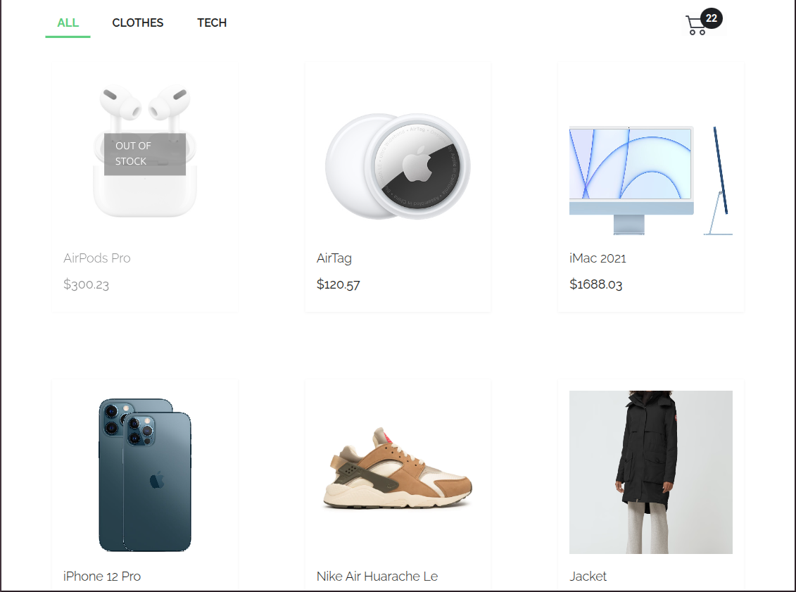
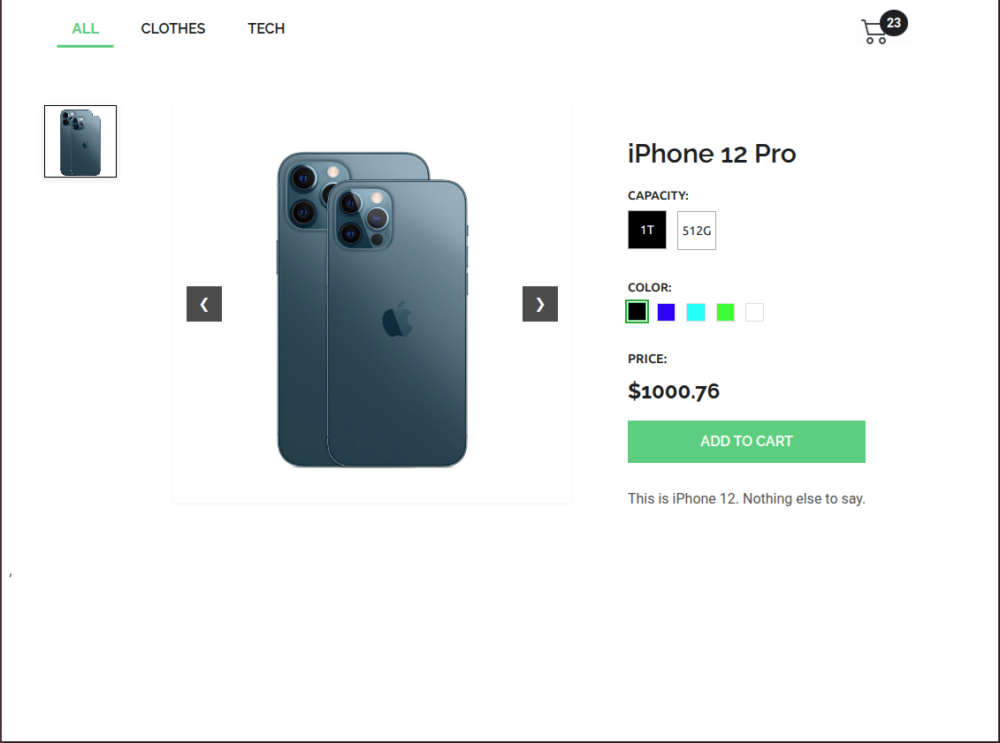
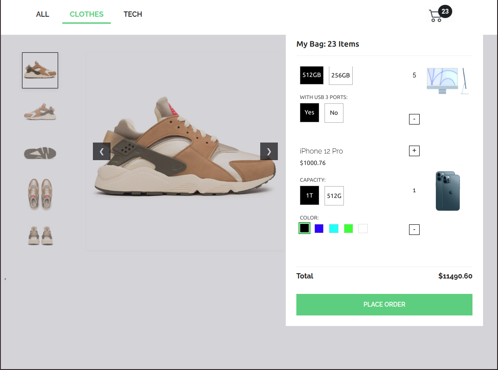

# Product-App-Dashboard

> This project is a web application that uses React to interact with an API created using PHP and MySQL. The application allows the user to view a list of available products, add products to the cart, and place orders.

## Screen shots

- 
- 
- 


## Built With

- 
- 
- 
- 
- 
- 
- 
- 
- 
- 

## Live Demo (if available)

[Live Demo Link](https://product-list-dashboard.vercel.app/)

## Author

👤 **Terbeche Mostefa**

- GitHub: [@githubhandle](https://github.com/Terbeche)
- LinkedIn: [LinkedIn](https://www.linkedin.com/in/mustapha-terbeche/)

## Setup

If you wish to run the project locally, please do the following:

1.- Clone the repository to your local machine. - **`git clone https://github.com/Terbeche/product-list-dashboard.git`** - **`cd product-list-dashboard`**

2.- Install Node.js and npm if you haven't already.
To install Node.js, follow the instructions on [Node.js](https://nodejs.org/en/).

To install npm with the necessary dependencies, run the following command in your terminal:

```bash
npm install
```

3.- Once you have the setup and the project locally, you can run the project using the following command in your terminal:

```bash
npm run build
```

4.- and if you want to watch the changes live, run the following command (it will run the website on localhost:5173):

```bash
npm run dev
```
